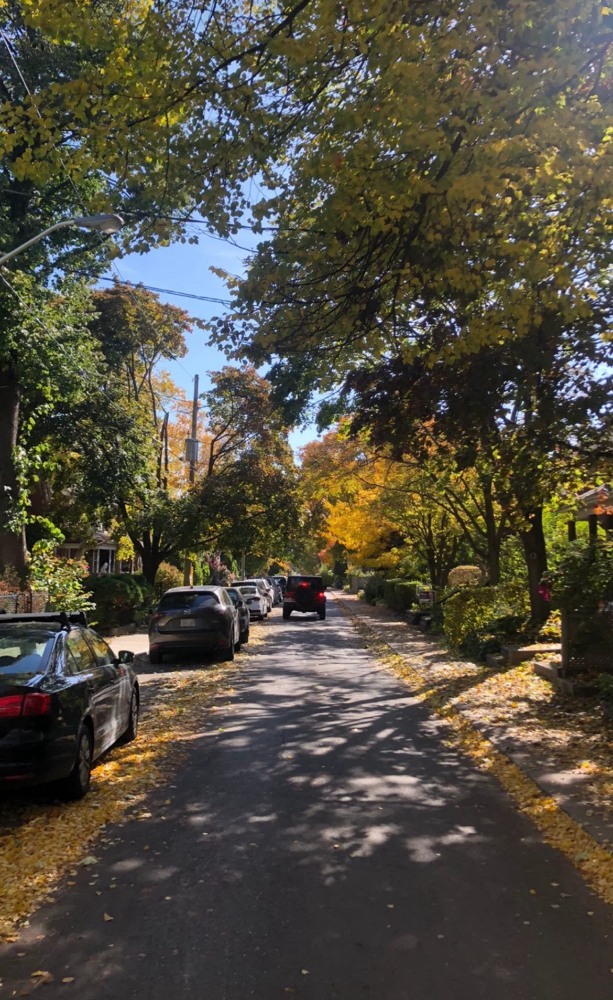

can i get a ORiGinaL cOoffEe?

肌を刺すような冷たい夜風が吹く中トロントピアソン空港に降り立った僕は、次の日の早朝に初めて Tim Hortons へ行った。(カナダのコーヒーチェーン店。ここではスタバよりも店舗数が多い。以下 tim)

僕の注文を聞くと、店員が？という顔をしている。そして列の後ろにはコンストラクションでこれから働きに行くであろう人たちが僕の時間がかかっている注文に少し苛立ちを抱えているのを感じた。

“you wanna coffee?“

そう聞かれたので、そうだと答えると”you want sugar? any milk?”と聞かれ、コーヒー屋さんで頼む砂糖とミルクの量は one,two,three と個数で答えると誰かのブログに書いてあったので”two sugar and two milk please”と答えた。

どうやらメニューには original coffee と書かれているけど、coffee だけで通じるみたいだ。逆にメニュー表通りに original coffee というと何だそれみたいな顔をされる。カナダの tim カルチャーに少し興味を持った。ほかにもローカルの人しか知らない注文の仕方もあるのかなと思った。

早朝のまだ薄暗い通りに出て歩きながらコーヒーを飲んでみると two sugar はすごく甘かった。

カナダが初めての海外長期滞在になるので、母親に無事に着いてコーヒーを頼めたとか、トロントは寒いとかテキストしたり、街の写真を撮って送ったりした。

特にやる事もなかったので自分の家の近くの St Clair st を 2 時間くらい歩いた。

これが僕が最初に体験した tim だった。

次の日にもう一度 tim でコーヒーを飲みたいと思い、昨日のような店員が？となる頼み方をしたくなかったので、ローカルの人が tim でどのように注文するのかをカナダ在住の人のブログを読んで確かめた。

“Can i get a large doble double please?”

これが original coffee のラージサイズの砂糖 2 つミルク 2 つを下さいという意味らしかった。

それを頭の中で復唱しながら昨日と同じ店に行くとお昼のせいなのか、学生や老人が列をなしていたがコーヒーが作られるのが速くて列も速く進んだ。(これが長く愛されるチェーン店の理由のひとつだと自分で勝手に思っている)

そして今回はちゃんと頼めた。これでカナディアンの仲間入り。イエイ！

店舗によって雰囲気、ドーナツやドリンクの種類が違ったり来る客層も違ったので、バイクメッセンジャーとして働いている間に休憩がてら色々な店舗に入って違いを楽しんでいた。

その中でトロントにある 2 つお気に入りの店舗を見つけた。

ひとつめは 130 Harbour St にある tim。ダウンタウンの中心にあるので内装がとても綺麗。そしてコーヒー以外にも抹茶ラテのホットが美味しい。一度違うお店でも抹茶ラテのホットを頼んだが味の違いに驚いたほど。しかし 6,7 ドルほどするので週に 2 杯までと決めていた。

そこの店舗はフェリーに乗ってきた観光客、Old Toronto にあるホテルを予約してきたであろう観光客がよく来て、彼ら彼女らが大きい電光掲示板のメニュー表をみながら何を頼もうか戸惑っている様子をよく目にする。その横で自分が何もみなくても頼むものは決まっているという風にサッと自分の注文を行ってサッとコーヒーを受け取って出ていくのがいかにもローカル/カナディアンっぽい振る舞いを出せて気持ちよかった。逆にローカルの人ばかりが集まる tim ではこの気持ちを味わうことはできない。

2 つ目のお気に入りのお店は 1251 Bloor St W にあるお店。ここは Eaton Center 側に向かって歩くと世界各国のレストランが並んでいるし、日本人が多いと言われている North York 側や海の方に向かって歩くと住宅街の街並みが本当に綺麗で

よくお店の横に自転車を止めてコーヒーを片手に散歩した場所。自分が「リフレッシュしたい！」と思ったらそこまで自転車で行き、コーヒーを片手に色んな国のレストランを見て回ったり、海側に向かって木々で囲われた住宅街をよく散歩をしたりしていた。だからその店舗が良いというより、散歩をスタートするためにうってつけのポイントだったからお気に入りのお店だったという理由だ。

あ、あとコーヒーカップにペンでスマイルを一番最初に書いてくれた店員さんがいるお店だったのでお気に入りになったというのも理由のひとつにある。

あの赤いカップを持って街を歩いていると自分がカナダのコミュニティの中の一員になれている気がして心地が良かった。トロントに 1 人で来たし 1 人で働ける仕事をしていたから”どこかのコミュニティに属したい”という気持ちがどこか自分にはあったのかもしれない。

無事一年間のワーホリ生活を終えてカナダから他の国へ飛行機を使って移動したら、そこの空港にはスタバがあった。tim は無かった。「ここはもうカナダじゃないんだ」それに気づいた時、赤いカップを持って色んな場所を歩いていた思い出が急に遠い過去のように感じた。
