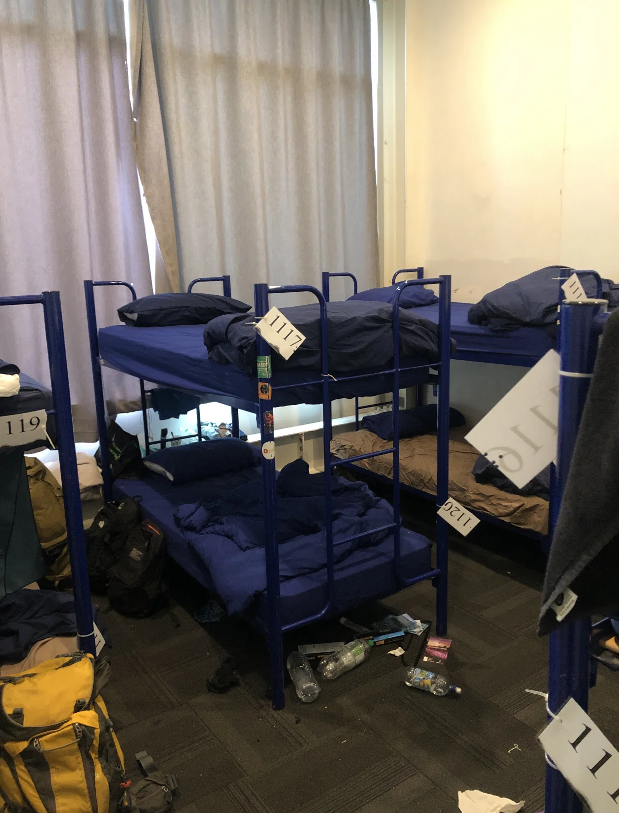
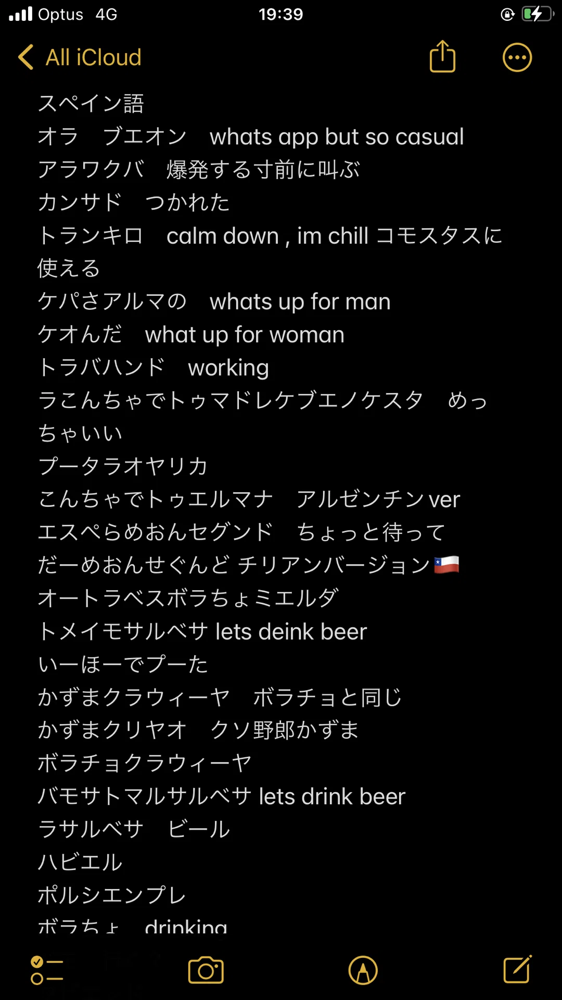
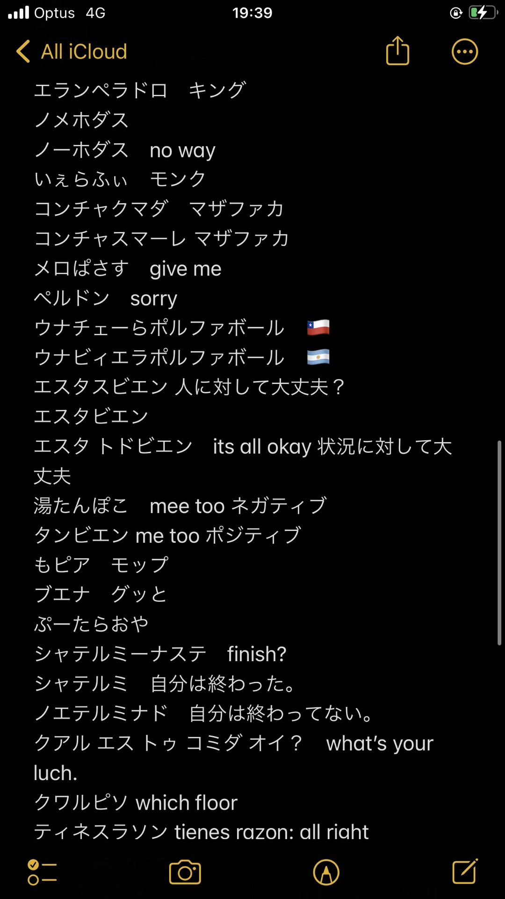
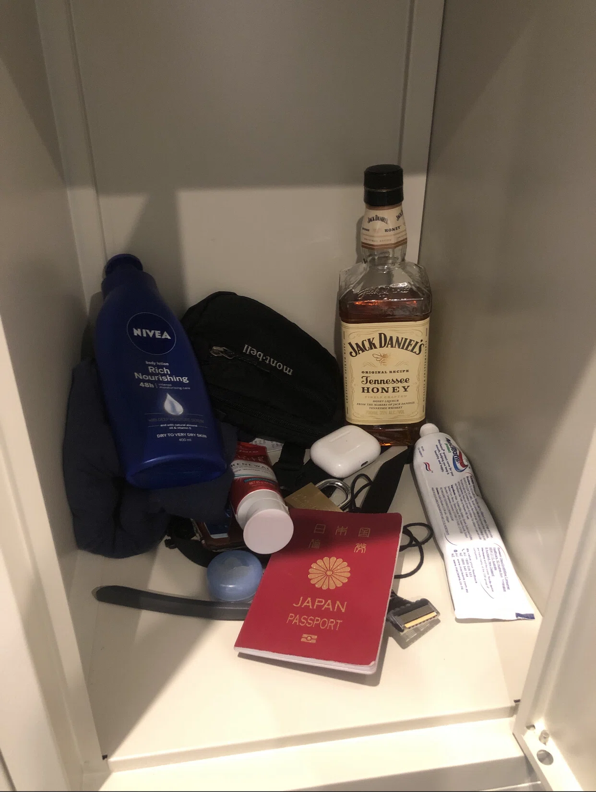
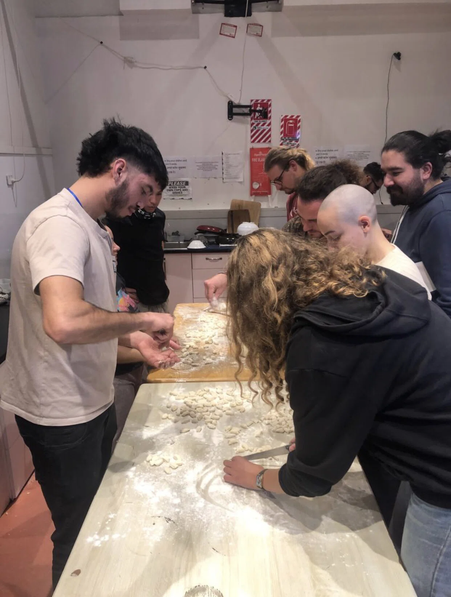
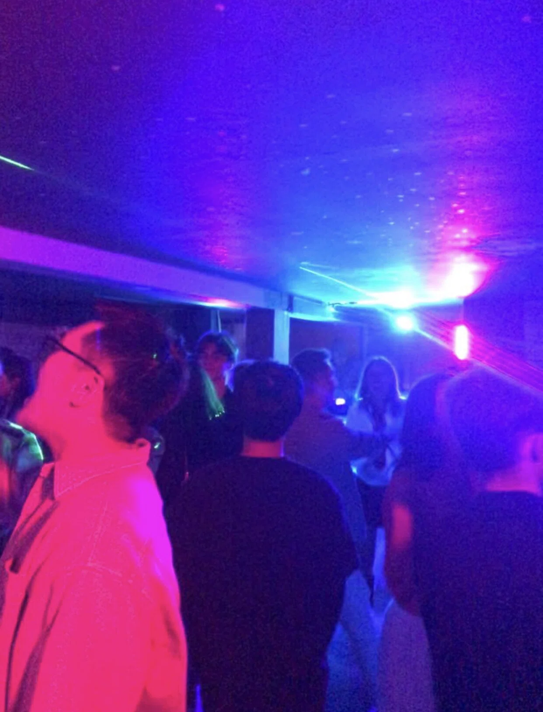
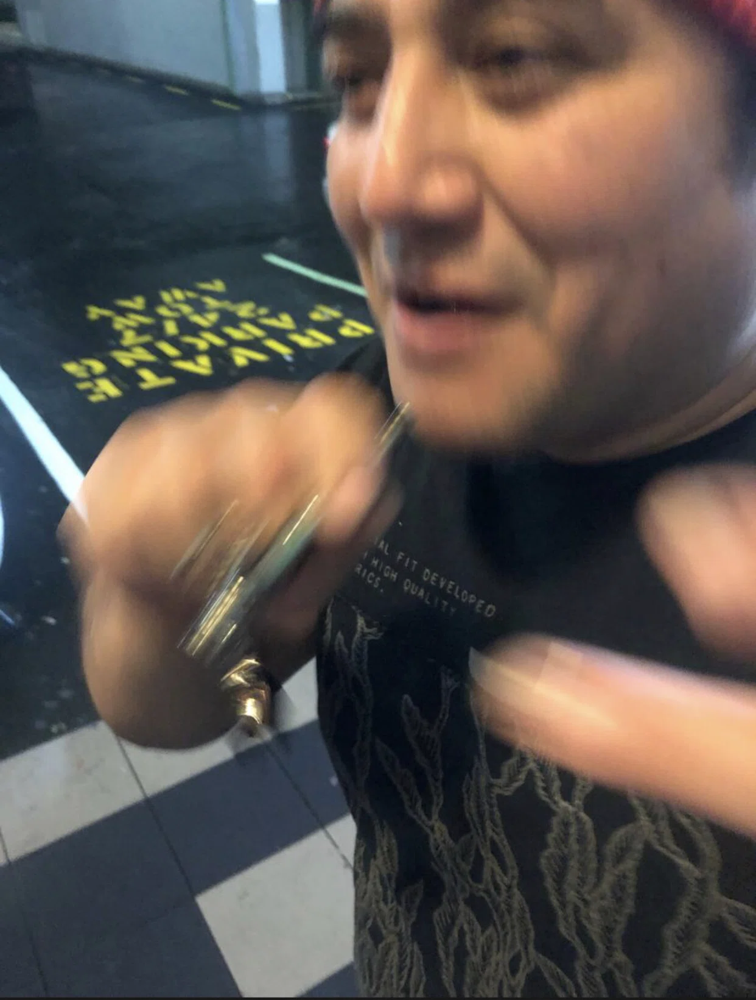
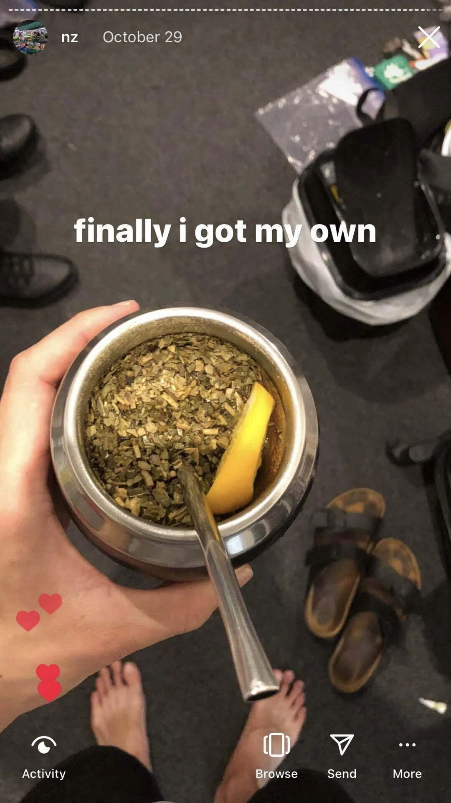
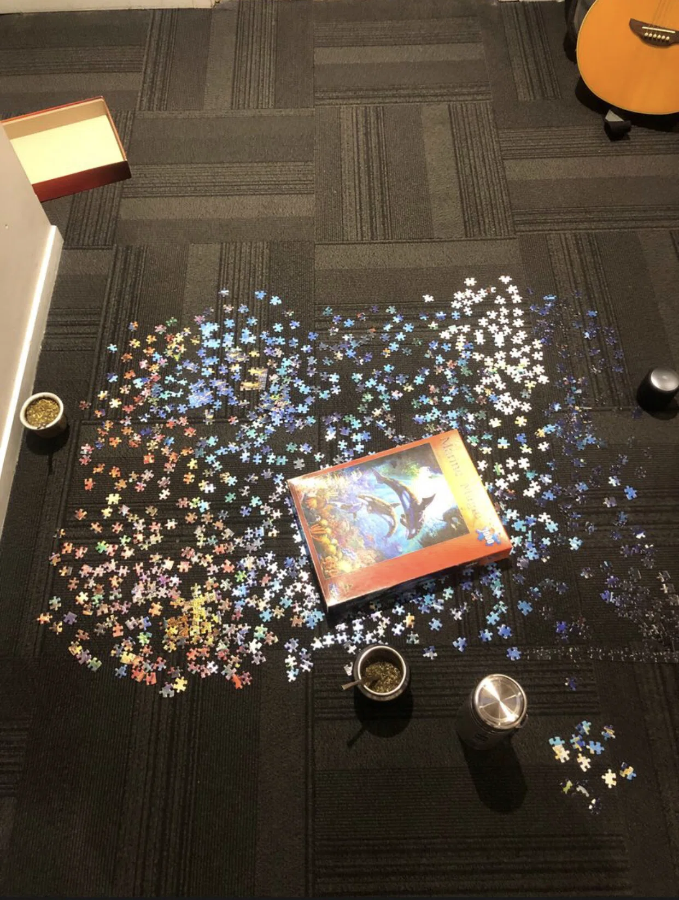
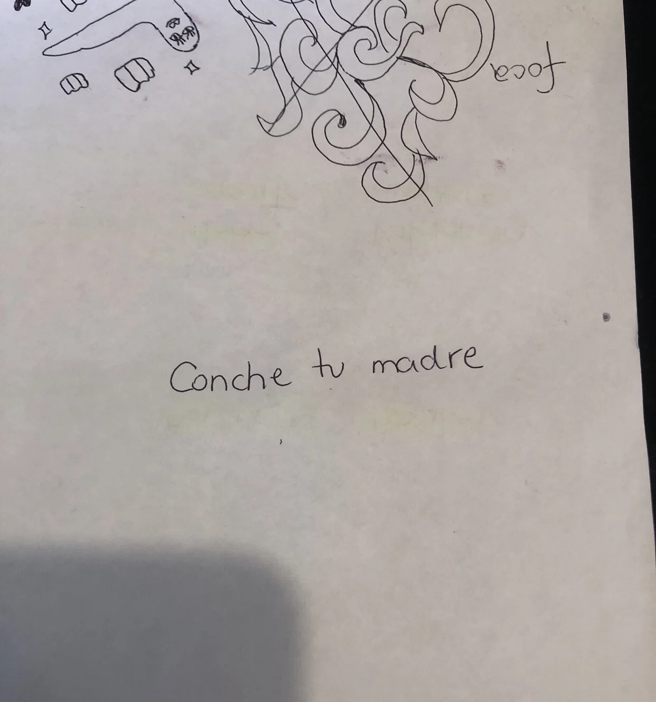

NZ でワーキングホリデーをしていた頃の話です。

あることがきっかけでバックパッカーズに 5 ヶ月間住むことになりました。(
http://kazumawada.org/blog/i-decided-imgonna-live-hostel-for-5-month/)
受付でチェックインをしてキッチンやバスルームなどを見て回っているとあることに気づきました。

「どこへ行ってもスペイン語ばかり聞こえる」

自分の部屋に入ってみると、10 人部屋でその内 6 人がラテン系の人でした。僕のバイト先の同僚は僕を合わせて 7 人いたのですが、僕以外 6 人全員チリ人でした。バイトへ行ってはスペイン語を聞き、バッパーへ帰ってもスペイン語を聞くという「ここ本当に NZ だよな?」「俺はラテン系の国に留学にでも来ているのか?」よくこんな気分になっていたのを思い出します。(この年にアルゼンチンとチリの NZ ワーホリビザの定員が 2 倍になったのが関係しています)

去年カナダのトロントでワーホリをしており、イタリアやポルトガル人が暮らす地域で一年間過ごし、NZ ワーホリの最初の半年もスペイン人のルームメイトと一緒に過ごし、”ワーホリではルームメイトに必ずラテン系の人がいる”と言う環境だったので、何かとラテン系に縁があるのではないかと前々から思っていましたが、(そもそもラテン系は世界中どこにでも沢山いるから、このような環境になったのは決して珍しいことではないのかもしれないが、、)まさか今回はここまで彼らに囲まれて生活することになるとは予想していませんでした。

因みに部屋はこんな感じです

## 英語よりスペイン語が上達した

先ほどにも書いたように、バイトに行きスペイン語を聞き、バッパーに帰ってはまたスペイン語を聞くという日常を送っていると、嫌でも少し単語が分かるようになりますし、彼らとコミュニケーションを取りたいと思うようにもなります。実際にメモ帳で気になった取りました。

彼らのおかげでラテン系の人と会うと、自分が知っている悪い単語(悪い言葉、単語は時には友達を作るときに大切です笑)を言ったりすると笑ってくれたり、自分に興味を持ってくれたりしてくれるようになりました。現在はシドニーのバッパーで暮らしているのですが、これらのリストは友達作りに大いに役立っています。

## 彼らは本当によく喋る

マグロは泳がないと死んでしまうそうですが、ラテン系の人の場合は喋っていないと死んでしまうのではないかな？というくらい一日中その場にいる誰かと話したり家族と電話で話したりしています。彼らが黙っているときは本当に何かを喋りたそうでソワソワソワソワしているんですよね。

僕の部屋に 6 人ラテン系のルームメイトがいたのですが、自分が一旦部屋に帰って荷物を置きすぐどこかへ行こうと思って部屋に戻ったら彼らの永遠に終わらない会話に巻き込まれ何度も自分のスケジュールが遅れたことがあります。未だに何故あんなに長時間話せるのか謎です。

## ボデータッチ

チリ人女性 6 人と一緒にバイトをしていましたが(最高だったー)、今は慣れましたが彼ら彼女らのボディータッチは日本人の僕からすると少し圧倒されました。挨拶をするときに頬と頬をお互いに擦り付けたり、ハグするときに思ったより強くハグされて、え、おっぱいすごい押し付けてくるけど大丈夫?これが普通なの?や、狭い道を通るときに肩をポンと触ってすり抜けていったりと「もしかして俺のこと好きなんじゃないの?」と勘違いしたくらい彼女らはベタベタ触って来ました。分かったのは、会話するのと同時に相手の体を触ったりするとより繋がりを感じられるし、暖かい気持ちになる事ができます。それ以来僕も意識して男同士で挨拶するときに拳を突き出してグーで相手の拳に自分の拳を当てて挨拶したり、すれ違う時に肩をポンと叩いたりと意識的にするようにしています。(ゲイっぽい触り方にならないように気を付けている)女性に対してのボディータッチはまだ全然躊躇しますが、、

## 週末のアルコールと音楽と草

今まで色んなバッパー、シェアハウスで生活して来ましたが、この時期以上にお酒を飲んだ経験はありません。金土の夜になると常に誰かしらがビール、ヴォッカ等を箱で買ってきて自分が部屋に戻ってくると「はいお前の!」と当然のように開けられたビールを手渡されます。スーツケースサイズのスピーカーも部屋に常備されているのでお祭り騒ぎでした。トイレに休憩しに行くと「あれ飲んでないね」と言われジーンズのポケットから缶のビールを渡されるなど、あそこで週末を過ごす場合アルコールから逃げることができません。

自分たちの部屋である程度盛り上がり、プレイルームやキッチンに行くとグループが輪になって地面に座り何かを話していたり、集団で何かを料理していたり、チェスをしている人らを囲ってみんなでそのゲームを眺めたりなど、シェアハウスに住んでいたら経験出来なかった事(色んなグループが色んなことをしているので、その場に飽きたら違うグループに行ったり出来たという事、長時間色んな人と話せたという事)が毎週のように繰り返されていました。ラテンの音楽に合わせて「こうやって踊るんだよ」と教わったり、ブラジル人が 5 人部屋に入って来て、音楽をブラジルの音楽に変えて彼ら独特のダンスをみんなで真似したりと

”毎週末うるさいけど違う国で育ってきた人と毎日交流しているっていう経験なんか貴重そうだからたくさん浸っとこ”

とよく感じていました。浸りすぎて夜にジャックダニエルを飲まないと寝れなくなった時期もありまが。(常にロッカーに常備してあった笑笑)

たくさん飲んだ後にみんなでクラブに行ったりもしました。因みに場所はオークランドに住んでいる人は「あそこか」と思うかもしれませんが、K road の familly bar です。僕的には奥にある天井が開けているラテンの音楽が常に流れているステージが好きです。大人っぽい感じがするので。バッパーにいる人はよくそこに行くので(バッパーのレセプションで働いている人がそこのクラブのマネージャーとして働いているという事も理由の一つ)、というかオークランドの街自体小さいので「あ、またあいつきてるわ」と友達同士会ってしまうというのもよくあります笑笑

この写真は family bar の隣にある gay クラブ(family bar の写真無かった)

草は色々あれだから省略

## マテ

アルゼンチン、ウルグアイ人(ラテン系)がたくさんいる環境にいると自然とキッチンなどでマテを目にします。これ ↓

キッチンに行った時に誰かがテーブルに置いたマテや実際にそれを飲んでいるシーンを頻繁に目にしていると、「自分もマテが欲しい」と思うようになります。(いや俺だけかも笑笑)そして上の写真で述べているように自分のマテを買いました。(もしオークランドでマテを買いたいという方がいたら、”pachamama latino store”に行けば買えます。)

買っただけではマテを飲む事が出来ず、ちゃんとしたマテ茶の作り方を知る必要があったので作り方を知っている人から教わってから飲みました。マテの細かい話をすると、マテはカフェインが含まれており、一気に飲むとコーヒーよりも強烈で心臓がバクバクしてしまうのでゆっくり飲む必要があったり、半分葉を湿らして、半分乾かして飲む必要がある(全ての葉をお湯に湿らせてしまうと、カフェインが強くなりすぎてしまって、飲む事が出来ない)、一旦ストローをセットしたらそこから動かしてはいけないなど、色々な決まりがありますが色んな人と話したり、彼らのマテを見ていると人によって違います。中にはオレンジやレモンの皮をマテに入れて飲む人もいます。

それ以来キッチンでマテを飲んでいると、「日本人のお前が何でマテを飲んでるんだ」と驚かれたり、新しく出会ったラテン系の友達に「俺マテを持っている」というと話に食いついてきてくれるようになりました。

こんな感じで友達とマテを飲みながらパズルをしたりしてました笑笑

## 最後に

“ラテン系”と聞くと「陽気」「気さく」「すぐ友達になれる」などを思い浮かべると思います。実際に彼らと 5 ヶ月間暮らしてみると本当にそうで、「他人にいきなり話しかけたら迷惑だし変な人だと思われたらどうしよう」と以前は心のブレーキがあったのですが、誰とでも気軽に話してしまう彼らと一緒に生活していると「うーん。少し緊張するけどこの人面白いかもしれないし、とりあえず話しかけてみよう」というマインドに変わっていました。というかラテン系の人と一緒に生活していると誰でもそうなる気がする笑笑だから自分が成長したというよりこの環境が自分を勝手に変えたのかもしれない。でもそれも成長と言えるのかもしれない。

