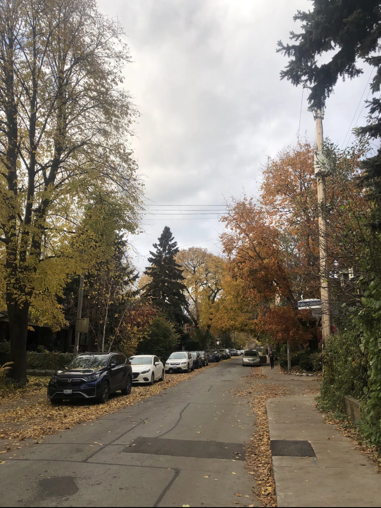

僕の想像だと「ワーホリ」と聞くと”どこかのカフェや美術館、クラブ、他の街への旅行をたくさんして充実させる”みたいな感じをソーシャルメディアの影響で勝手に想像するのですが、実際の僕のワーホリは生活のために働いて、将来のために勉強して、馴染みのスーパーに行き、サイクリングをしたり、途中で自転車をどこかに停めて timhortons のラージダボーダボー(笑)を飲みながらトロントの街を散歩したり、たまに自分の自転車を家の前でメンテナンスしたり、部品を MEC へ買いに行ったりという単調な毎日でした。孤独だったけど自分がそういう生活をする事を望んでいました。

というのも日本に居た時は実家暮らしで毎日毎日親から何か怒られていたり、大学卒業したらワーホリに行くと言ったら「将来どうするんだよ」「ちゃんと働けよ」とか言われっぱなしで、自分の将来像がその影響で気が散ってしまい、この環境だと自分の事を考えられなかった。(もっと自分が 1 人になれる時間、場所を自分で上手に見つけられたらわざわざカナダに行ってなかったのかもしれないけど。)だからカナダワーホリに行って、1 年間はずっと 1 人で居たい。1 人で丁寧に生活を送って自分の心の声だけを聞いていたい。他の人の自分に対しての意見は聞きたくない、ほっといてくれと思っていました。

(その反動で「このまま誰とも話さないのはヤバイ、若いエネルギーを無駄にしている感じがすると思い、その後に行った NZ ワーホリ、オーストラリアワーホリをしている時に常に誰かしら話す人がいるホステルに住む事になったんだけどここでは割愛)

だから、自分が「カナダワーホリってどうだったかな？」と思い返すと友達とか他の街への旅行の思い出とかではなく、

「国や文化が違う中でちゃんと自分でお金を稼いで生活できたな。色々辛い事があったけど成長したな自分」とか、

自分が通っていた馴染みのお肉屋さんの店員の顔を思い出して「今頃何してるんだろうな」とか、

ちゃんと自分 1 人で 1 年間海外で生活する能力があったんだなとか、

秋のトロントの街を自転車で駆け抜けたあの快感をもう一度味わいたいな

とか、

夜ルームメイトのみんなで木々に囲まれたバックヤードに集まって星空を見ながら草を回して話したの心地よかったな、みんな元気かなとか、

馴染みのブッチャー(お肉屋さん)のお客さんと店員さん殆どポルトガル人で構成されていて奇妙な世界観だったなとか、(自分が住んでいた場所がポルトガル人とイタリア人が沢山住んでいるコミュニティだった)

トロントの街は坂が少なくて街並みも綺麗だから自転車を漕ぐにはうってつけの場所だったんだけど、凸凹な道路ばかりだったなとか、

お金が無いと嫌なオーナーに当たっても簡単に住む家を変えられない、悔しかったなとか、

ダウンタウンで 3 人の男が喧嘩していて、黒人のナイフを持った人のパーカーが血だらけになっていたのを間近で見て「こういう環境で暮らすなら筋トレして強くならないといけないな」と思ったり、

1 人でずっと過ごすと、自分はこういう事が出来てこういう事ができないというのを誰の意見も聞き入れずに自分でちゃんと分析できるんだなとか、

庭でがっつり大麻を栽培していて、週末になるとレゲエを大音量で流す、まるで映画の世界ような隣人のおっちゃん元気かなとか、

冬寒かったなとか、(本当に寒かった。風が吹くだけで風が頭蓋骨を通り越して脳みそが震えた。寒いとかではなく痛い。)とか

住んでいた家が工事中で(え？！)ポルトガル人の大工 3 人がよく休憩しにキッチンでくつろいでた時に時々話し相手になったり、工事中に彼らがよく喧嘩してたの面白かったなとか、

本当に 1 人だったからちょっと寂しい時に音楽によく助けられたなとか、

今振り返ってみるとそういう事を思い出す。

決して「あ、もっと友達作っていろんな場所に行けばよかったな」とか思わなかった。後悔なく暮らす事ができた。

あの 1 年間は本当に 1 人になりたかったから、FB もインスタもカナダの日本掲示板 e maple 等も全くみなかった、(投稿はしていたけど、)ニュースとかも自分の心に影響してしまうから見ずに、どこに誰がいて何が起こっているのか全くわからなかった。(安部首相が撃たれたのはカナダでも大ニュースだったからそれは見た。)本当に自分 1 人だけの世界になれたので良かった。沢山自分の内側と会話ができた。

ついついソーシャルメディア等で自分と同じワーホリをしている人を見ると、(全く見なかったと書いたけど、少しは気になって見た)キラキラしているように見えるけど、「本当に自分は彼らみたいな行動をしたいのか？」「ただ好きでもない、気にしてもないみんなにソーシャルメディアでキラキラ見せるように演出して自分のやるべき事と違う事をやっているのではないか？」「本当に自分がやりたい事、やるべき事って何だろう？」って考えてみると、自分のやりたい事が浮かんできて、それを実行して、その後に振り返ってみると、後悔なくちゃんと生きれたな、自分！と思えると思う。今回の僕のカナダワーホリのように。

「ワーホリ」と聞くとついついソーシャルメディアでみんながやっているキラキラしている物事に目が行ってしまいがちだけど、(みんなは違って多分俺が勝手にそう思っているのかもしれない笑笑)自分が本当にやるべきことって何だろう？好きでもない、気にしてもいないみんなに自分が充実した生活をしている演出をして見せて、本来の自分がやりたい事と違う事をやっていないだろうか？自分がやるべき事って何だろう？とか考えてみて後悔のない自分色に染めた生活をすると、後から「あの時行ってよかったな」と心の底から満足できると僕は思う。
