ニュージーランドっぽいような「羊がたくさんいる！」, 「湖が家を出てすぐそこ!絶景！」, 「山々に囲まれている！」みたいな感じではなく至って普通の住宅街にある家に暮らしていました。向かいの通りの家がクリスマスツリーを栽培しているでかい庭がある少し特殊な場所だったけど。。

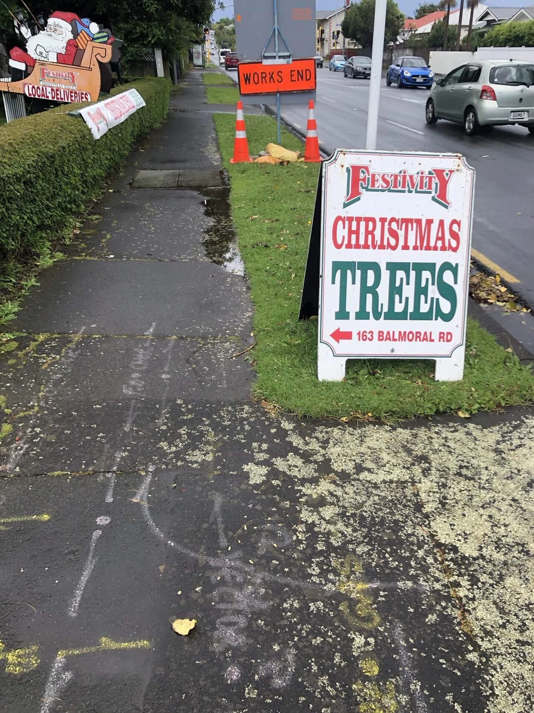

普通の住宅街とは言っても観光地で有名な Mt Eden という山が近くにあったし(よくランニングしに行っていた。20 分程度で登れる山だった。

その山の近くにある Mt Eden road にはたくさんのカフェやレストランが並んでいて観光客がちょくちょく来る場所だった。(別に沢山ではないけど、NZ にしては沢山という意味)

さらに不定期で開催されるビンテージのマーケットの開催地が徒歩 10 分の場所にあった。(多分オークランド最大級)

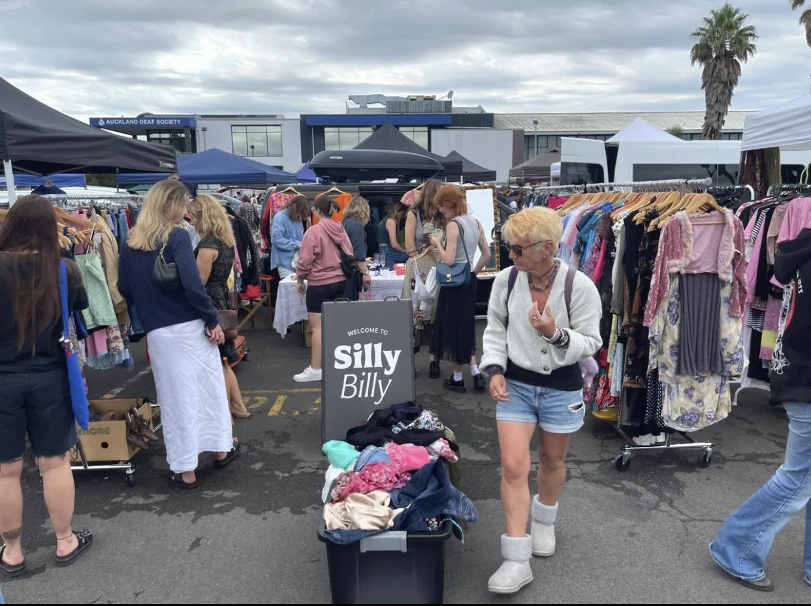

家賃も$150/週で、オークランドの中心地までバスで 15 分とロケーションに恵まれた場所でもあった。(こうやって書いてみると意外と良い場所だったのかも。普通の住宅街とか言って少しあの家に失礼だったかな。)

一番のネックは Cowntdown(スーパー)が徒歩 30 分くらいかかった事。バスを使ったら待つだけで 15 分くらいかかるし、手を上げないと止まってくれないし、さらに時刻が正確ではないからバスが通り過ぎないように常にバスが来る方向を見ていないといけないというのが本当にストレスだったからいつも歩いてスーパーへ向かっていた。PAK'nSAVE(スーパー)にかかってはバスが来なかったら歩いて 50 分くらいかかった。(さすがニュージーランドこれがニュージーランド)。

でもまあ根気よく待ってバスに乗った場合、2 階建てのバスから見える NZ の街並みとかバス停から歩いて家まで帰る道のりはすっごくニュージーランドっぽかった(語彙力笑笑)。なんというかニュージーランドの夏って世界に一つだけで夏にニュージーランドに行かないとこの雰囲気って味わえないんだなと思った。(いやだから語彙力笑笑)写真で伝えたほうが早い ↓

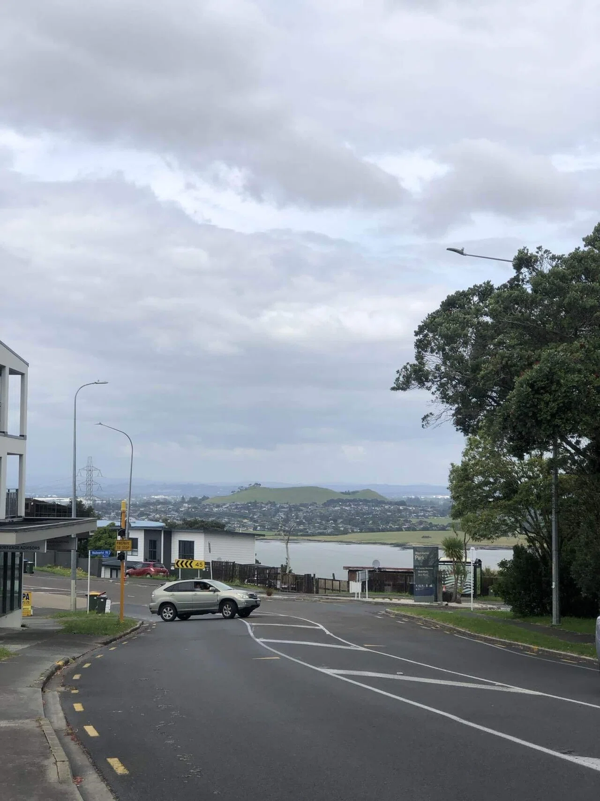
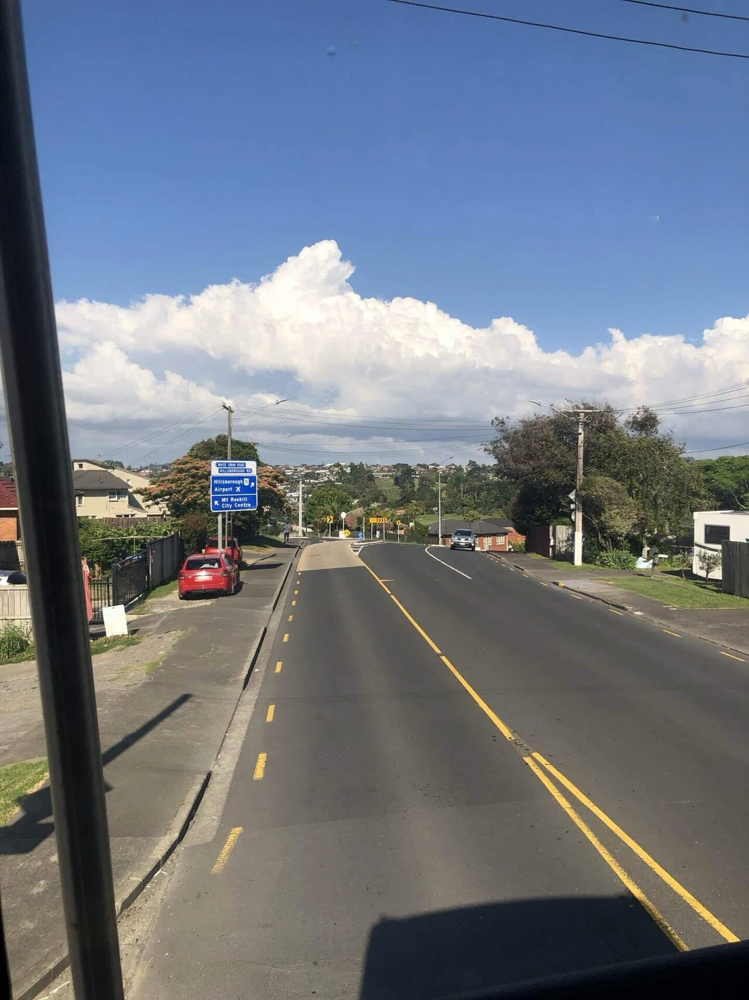
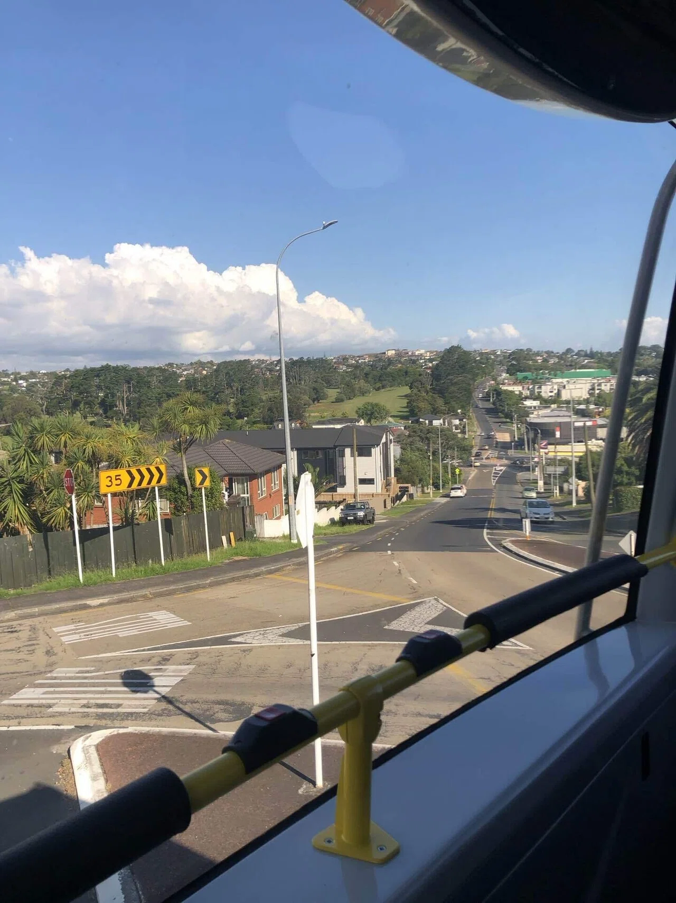
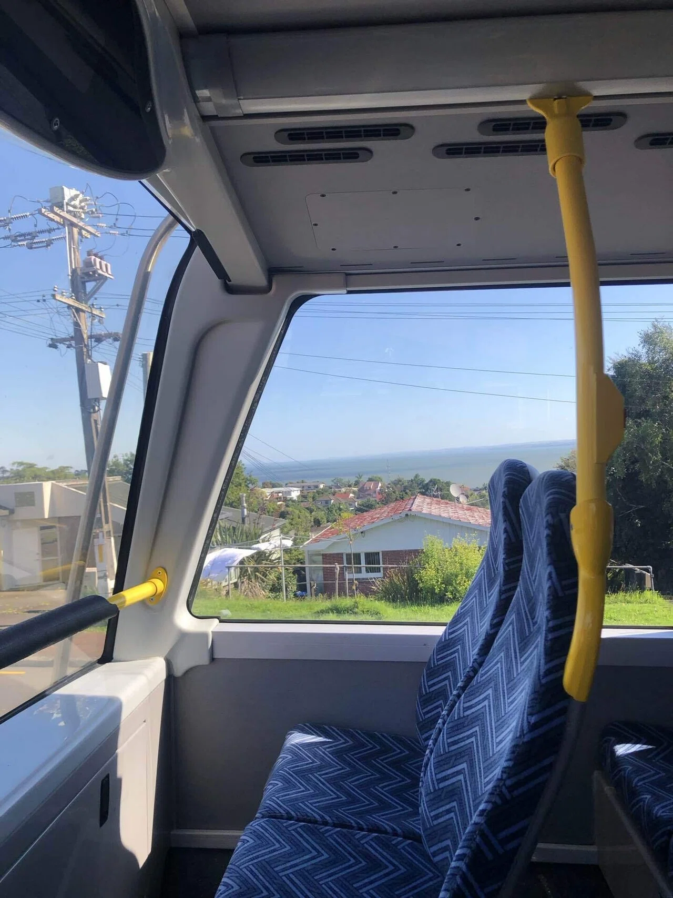
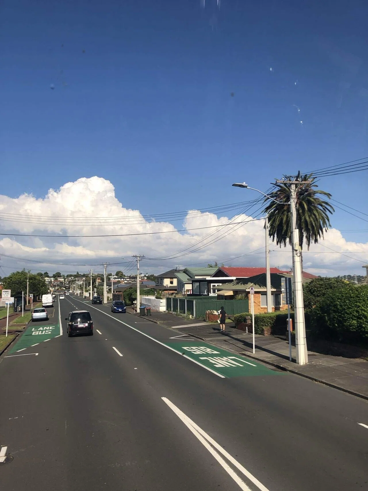

また、先ほどにも言ったようにバイト先のオークランド中心部まで家からバスで 15 分、そして自然に囲まれた静かな住宅街に僕の家があったのでバイトで都会の街に行き、家に帰ってくると山などの自然に囲まれた田舎の雰囲気を味わえるという都会と田舎の両方を毎日体験できているような感じがしてお得感があった。

家の中はこんな感じです。

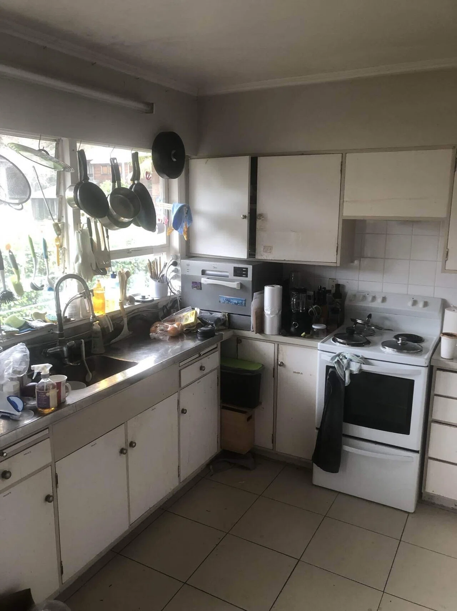
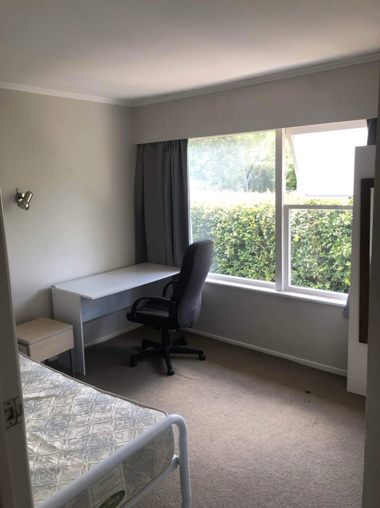
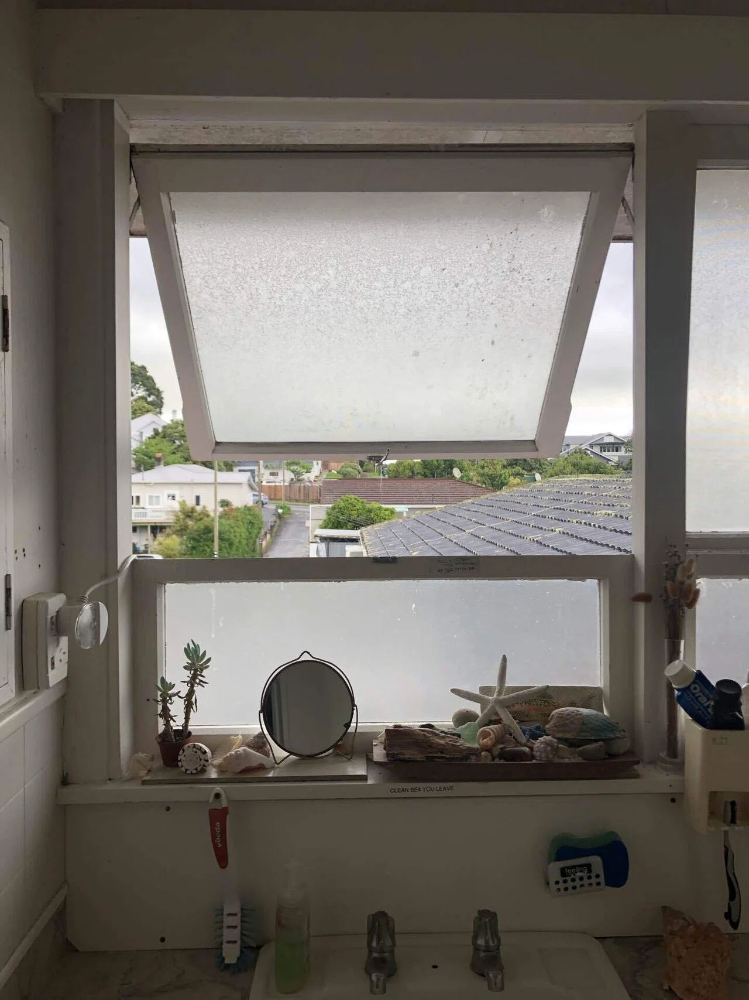

ここに僕とスペイン人の学生、ワークビザを取得して働いている香港人と 3 人で一緒に住んでいました。あ、あとオーナーも一緒に住んでいました。

夜たまたまみんなが同じ時間帯にキッチンに集まったら、オーナーも合わせて一緒に 4 人で何かを話したりよくしていました。今まで住んできたシェアハウスはそれぞれの作業に集中して相手とあまり関わらなかったり、英語がうまく喋れないルームメイトがいて会話が成立しなかったりという感じだったので、初めて”家庭感”をシェアハウス生活で感じる事ができた。

その時に働いていた寿司屋のバイトは自分と年代が違ったので話が合わず、僕自身友達もあまりいなかったから、夜ご飯のこの 4 人で何かを話す時間が結構好きだった。自分は日本にいる家族とは重要な要件以外全くと言って良いほどコミュニケーションを取らなかったので、このフラットで生活していて”家族団欒ってこんな感じなんだろうな”と勝手に想像していたりもした。

自分が一人の世界になりたい時でもキッチンにいるとオーナーがガンガン話しかけてくるのでたまに「静かにして欲しいな」とか思ったりもしますが、彼の子供 2 人(2 人とも 20 代後半)は違う場所で暮らしていて奥さんもいなかったので自分と何かを話したい気持ちはわかります。、、そもそも自分の口数が少ないから気を使って話しかけてくれたのかもしれないけど。うん、そうだったのかもしれない笑笑

その他にもオーナーが彼の子供と一緒に週末にテニスやバトミントンに連れていってくれたり、教会に連れていってくれたり、コストコ(コスコ)に連れていってくれたりしました。また、オーナーは一ヶ月に 1 回くらいの頻度で夜ご飯を子供 2 人と一緒に自分たちのフラットに招いて食べている。「この年代になってもこうやって頻繁に家族の時間を作るっていいな。羨ましいな」と思いました。

オーナーに自分と同じ年代くらいの子供がいるから何だか自分は口数少ないんだけど自分の思っていることはお見通しなのではないかと思ったりもした。　喋らなくても心を見透かされているような気分だった。

スペイン人のルームメイトとも週末に彼の友達と一緒にフリーマーケットへ行ったり、MtEden に登ってピクニックをしたりしました。(夏にこの山に登るときは頂上でピクニックをするのめっちゃおすすめですよ！！！静かだし、何も遮るものがないし、景色が綺麗だし。)

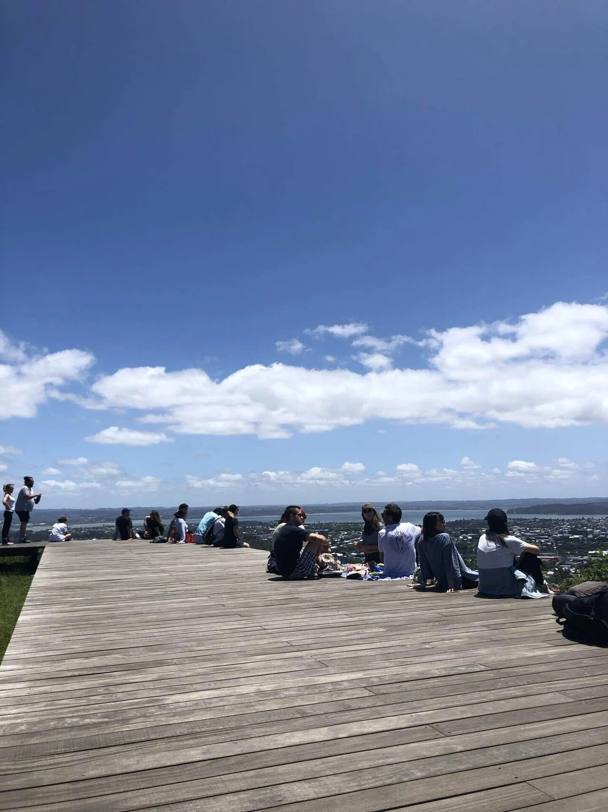
頂上でピクニックしたり寝転がったりするの最高です
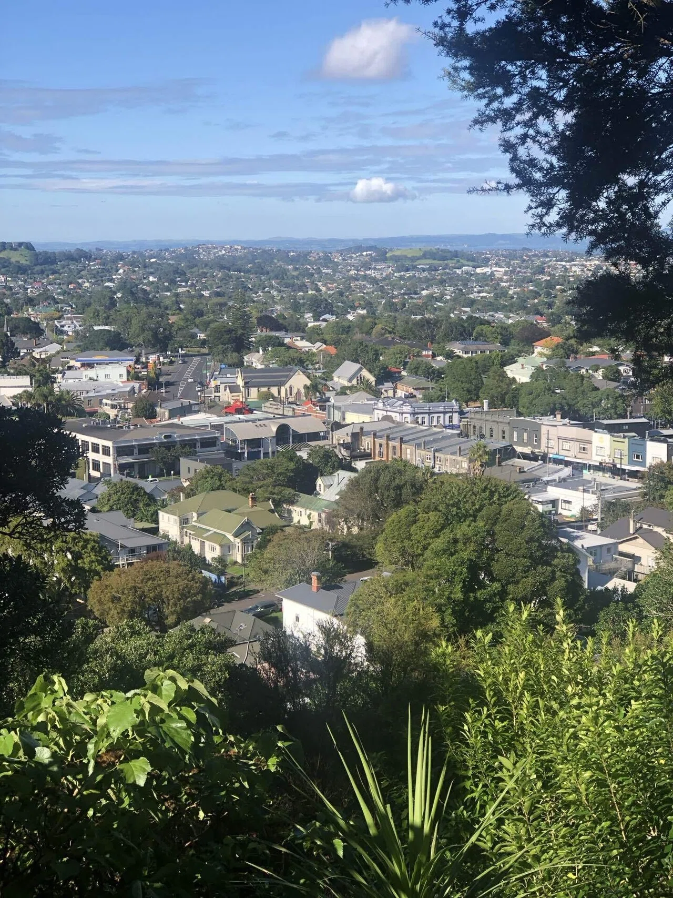
MtEden から見える MtEden road

# 最後に

結局この家追い出されちゃって、その後 5 ヶ月間バックパッカーに住み、そこで過ごした時間がすごく濃かったから「最初からバッパーに住んでおけばよかったなー」とか思っていたんだけど、
http://kazumawada.org/latinlatinlatin

こうやってフラットで生活した経験を記憶を辿って書いてみると、俺シェアハウスでも良い経験してたんだな。。追い出されてすぐにバックパッカーの人たちとたくさん話したりして溶け込もうとし、それが終わったらすぐシドニーに飛んだからう振り返る時間が無かったけど、文章にまとめることで良い記憶が蘇ってきたからここまで書いてみて本当に良かった。ああ、NZ 飛び立つ時にオーナーに「ありがとう」とか言っとけば良かったな。でも多分あの人俺の事分かってるから大丈夫
